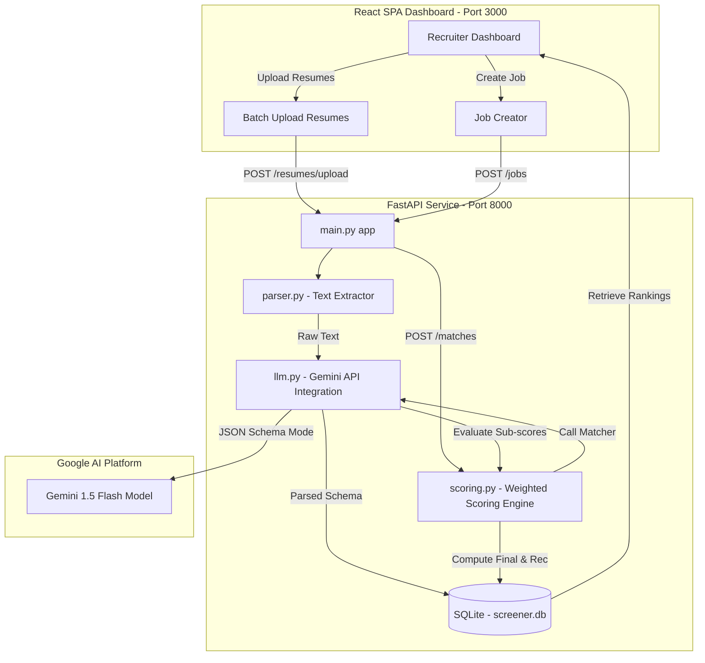

# Smart Resume Screener (Recruiter Platform)

An intelligent, recruiter-focused screening application that automatically parses candidate resumes, analyzes role-fit profiles, and ranks candidates against job descriptions using Google Gemini AI.

---

## 1. Project Overview
The **Smart Resume Screener** is designed for modern hiring teams to handle high volumes of applicants. Instead of screening PDF resumes manually, recruiters can upload dozens of resumes simultaneously, view candidate profiles in structured cards, and see applicants ranked instantly by a transparent, weighted AI score with evidence-based justifications.

## 2. Problem Statement
Recruiters waste hours scanning hundreds of resumes for a single job opening. Basic resume keyword checkers are easily fooled and fail to assess deep semantic fit. Conversely, sending raw, unvalidated resumes to LLMs in bulk is expensive, lacks predictability, and yields inconsistent structures. 

The Smart Resume Screener solves this by:
1. **Structuring Resume Data**: Parsing raw text once into a strict JSON format (Pydantic validation).
2. **Semantic Matching**: Comparing only structured profiles against job descriptions.
3. **Transparent Weighted Scoring**: Handing the scoring calculation to the backend engine using configurable weights instead of letting the LLM arbitrarily guess a final number.

## 3. Features
* **Batch Resume Uploads**: Upload 5–20 PDF or TXT resumes at once.
* **Intelligent Text Extraction**: Integrates `pypdf` with robust alphanumeric volume verification.
* **Structured Parsing (Gemini AI)**: Standardizes candidate name, contact details, skills, experience, and education under strict Pydantic schemas.
* **Transparent Weighted Scoring**: 
  * Skills (40%)
  * Experience (30%)
  * Education (10%)
  * Role Fit (20%)
* **Deterministic Verdict Mapping**: Maps final scores directly to `SHORTLIST` ($\ge 8.0$), `REVIEW` ($6.0 - 7.9$), or `REJECT` ($< 6.0$).
* **Evidence-Based Explanations**: Lists exact candidate strengths, gaps, and an AI justification explaining the fit.
* **Interactive Recruiter Dashboard**: Search candidate by name, filter by score, filter by recommendation, and sort rankings.
* **Interactive OpenAPI Specs**: Fully documented FastAPI endpoint tests at `/docs`.

---

## 4. Architecture Diagram


---

## 5. Technology Stack
* **Backend API**: Python 3.11, FastAPI, SQLAlchemy, SQLite, Pydantic, python-multipart, Uvicorn.
* **LLM Engine**: Google Gemini Python SDK (`google-generativeai` >= 0.8.0), Gemini 1.5 Flash.
* **PDF Parser**: `pypdf`.
* **Frontend Dashboard**: React 18, Vite, Tailwind CSS, Lucide React, Axios.

---

## 6. Project Structure
```
/
├── backend/
│   ├── app/
│   │   ├── routes/
│   │   │   ├── __init__.py
│   │   │   ├── jobs.py
│   │   │   ├── resumes.py
│   │   │   └── matches.py
│   │   ├── __init__.py
│   │   ├── database.py
│   │   ├── llm.py
│   │   ├── main.py
│   │   ├── models.py
│   │   ├── parser.py
│   │   ├── schemas.py
│   │   └── scoring.py
│   ├── uploads/
│   ├── .env.example
│   └── requirements.txt
├── frontend/
│   ├── src/
│   │   ├── App.jsx
│   │   ├── index.css
│   │   └── main.jsx
│   ├── index.html
│   ├── postcss.config.js
│   ├── tailwind.config.js
│   └── vite.config.js
├── .gitignore
└── README.md
```

---

## 7. Environment Variables
To run the backend, create a `.env` file in the `backend/` directory by copying `.env.example`:

```bash
# In backend/ directory
cp .env.example .env
```

Define the following variables inside `backend/.env`:
* `GEMINI_API_KEY`: Your Gemini API key. Get one for free at [Google AI Studio](https://aistudio.google.com/).
* `DATABASE_URL`: The SQLite file database path. Default is `sqlite:///./screener.db`.
* `PORT`: The backend server port (default `8000`).

---

## 8. Database Design
The application uses SQLite as its persistent store with three SQLAlchemy models:

### Job
* `id` (Integer, Primary Key)
* `title` (String, Indexed)
* `description` (Text)
* `created_at` (DateTime)

### Resume
* `id` (Integer, Primary Key)
* `filename` (String)
* `raw_text` (Text)
* `name` (String, Indexed)
* `email` (String)
* `phone` (String)
* `skills` (JSON List)
* `experience` (JSON List of objects)
* `education` (JSON List of objects)
* `created_at` (DateTime)

### Match
* `id` (Integer, Primary Key)
* `resume_id` (Integer, Foreign Key referencing Resumes)
* `job_id` (Integer, Foreign Key referencing Jobs)
* `score` (Float - Weighted Final Score out of 10)
* `skill_score` (Float)
* `experience_score` (Float)
* `education_score` (Float)
* `role_fit_score` (Float)
* `justification` (Text)
* `strengths` (JSON List of strings)
* `gaps` (JSON List of strings)
* `recommendation` (String: `SHORTLIST`, `REVIEW`, `REJECT`)
* `created_at` (DateTime)

---

## 9. Resume Extraction & Text Validation
We utilize `pypdf` to extract text. To prevent scanned documents, corrupted layouts, or empty files from passing through to the LLM (which wastes token usage and yields poor evaluations), the parser performs the following text validation checks:
1. Trims and checks for whitespace emptiness.
2. Evaluates the count of alphabetical letters. If `letters_count < 50`, it assumes the PDF is scanned/non-selectable and raises a `400 Bad Request` with a clear user prompt: *"PDF appears to be empty or contains only images (scanned PDF). Please upload a text-based PDF."*

---

## 10. LLM Prompts & Architecture

We utilize Gemini 1.5 Flash with **JSON Schema mode** to enforce strict API responses.

### Prompt 1: Resume Parser
**Input**: Raw resume text.
**Goal**: Standardize contacts, skills, jobs, and educational titles.
**System Prompt**:
```text
You are an expert HR assistant and resume parser.
Analyze the following raw resume text and extract structured information.

Extract:
1. Candidate's full name.
2. Email address (if found).
3. Phone number (if found).
4. Technical and soft skills (extracted as a clean list of strings).
5. Work experience history: for each job, extract company, role, duration/dates, and a brief description of duties/achievements.
6. Education: for each degree/certificate, extract institution, degree, and graduation year/date.

Be accurate and only extract information present in the text. If a field is not found, leave it empty or null.
```

### Prompt 2: Candidate Matcher
**Input**: Structured candidate profile (JSON) + Job Description text.
**Goal**: Score alignment on 4 sub-dimensions (1-10) and extract evidence-based lists.
**System Prompt**:
```text
You are a professional recruiter.
Compare the following structured candidate profile with the job description.

Evaluate the candidate on four dimensions, scoring each from 1.0 to 10.0 (where 1.0 is no match, 10.0 is perfect alignment):
1. skill_score: Technical and soft skills alignment.
2. experience_score: Years, quality, and relevance of work experience.
3. education_score: Degree, institution, and field alignment.
4. role_fit_score: Overall role alignment, characteristics, and domain relevance.

Provide:
- strengths: A list of specific, evidence-based strengths (what skills or experience they have that align with requirements). Avoid generic phrases like "Good candidate."
- gaps: A list of missing skills, experience deficits, or educational mismatches. Be specific (e.g. "No React experience mentioned" rather than "Lacks front-end skills").
- justification: A detailed, cohesive explanation summarizing the score rating and fit. Back up your scores with exact facts from the candidate's profile.
```

---

## 11. Scoring Methodology
We calculate the final score in Python to prevent LLM volatility:

$$\text{Final Score} = (\text{Skills} \times 0.4) + (\text{Experience} \times 0.3) + (\text{Education} \times 0.1) + (\text{Role Fit} \times 0.2)$$

### Recommendation Mapping:
* **Score $\ge$ 8.0**: `SHORTLIST` (Green)
* **Score 6.0 - 7.9**: `REVIEW` (Yellow)
* **Score < 6.0**: `REJECT` (Red)

---

## 12. API Documentation

FastAPI exposes interactive OpenAPI documentation at `/docs` (Swagger UI) or `/redoc` (ReDoc).

### Job Endpoints
* `POST /jobs`: Create a job description.
* `GET /jobs`: Retrieve all jobs (most recent first).

### Resume Endpoints
* `POST /resumes/upload`: Batch upload (`files: List[UploadFile]`) and parse resumes.
* `GET /resumes`: List all parsed candidate resumes.

### Match Endpoints
* `POST /matches`: Evaluate candidates against a job description.
  * Request Body: `{"job_id": 1, "resume_ids": [1, 2]}` (leave `resume_ids` empty to evaluate all candidates).
* `GET /matches`: Get ranked candidates for a job, optionally filtered by recommendation.
* `GET /matches/{match_id}`: Retrieve detailed breakdown of scores, strengths, gaps, and AI justification.

---

## 13. Example Input & Output

### Example Request (`POST /matches`)
```json
{
  "job_id": 1,
  "resume_ids": [1]
}
```

### Example Response JSON
```json
[
  {
    "id": 1,
    "resume_id": 1,
    "job_id": 1,
    "score": 8.6,
    "skill_score": 9.0,
    "experience_score": 8.0,
    "education_score": 8.0,
    "role_fit_score": 9.0,
    "justification": "The candidate demonstrates strong alignment with the required Python, backend, and machine-learning skills. However, the resume does not provide strong evidence of production cloud deployment experience.",
    "strengths": [
      "Strong Python and machine-learning experience.",
      "Relevant FastAPI/backend projects.",
      "Good SQL knowledge."
    ],
    "gaps": [
      "No demonstrated AWS experience.",
      "Limited production deployment experience."
    ],
    "recommendation": "SHORTLIST",
    "created_at": "2026-08-22T22:45:00Z",
    "resume": {
      "filename": "john_doe_resume.pdf",
      "name": "John Doe",
      "email": "johndoe@email.com",
      "phone": "+1234567890",
      "skills": ["Python", "FastAPI", "SQL", "PyTorch"],
      "experience": [
        {
          "company": "AI Tech Corp",
          "role": "Machine Learning Engineer",
          "duration": "2024 - Present",
          "description": "Built backend APIs using FastAPI and trained models."
        }
      ],
      "education": [
        {
          "institution": "State University",
          "degree": "B.S. Computer Science",
          "graduation_year": "2023"
        }
      ]
    },
    "job_title": "Senior ML Engineer"
  }
]
```

---

## 14. Setup & Running Instructions

### Prerequisites
* Python 3.11+
* Node.js v20+ / npm v10+

### How to Run the Backend
1. **Navigate to backend**:
   ```bash
   cd backend
   ```
2. **Create and Activate Virtual Environment**:
   ```bash
   python -m venv venv
   # On Windows:
   .\venv\Scripts\activate
   # On macOS/Linux:
   source venv/bin/activate
   ```
3. **Install Dependencies**:
   ```bash
   pip install -r requirements.txt
   ```
4. **Setup Environment**:
   Create a `.env` file from `.env.example` and fill in `GEMINI_API_KEY`.
5. **Run the Uvicorn Server**:
   ```bash
   python -m uvicorn app.main:app --host 0.0.0.0 --port 8000 --reload
   ```
   The backend API will run on `http://localhost:8000`.

### How to Run the Frontend
1. **Navigate to frontend**:
   ```bash
   cd frontend
   ```
2. **Install Node Packages**:
   ```bash
   npm install
   ```
3. **Start the Development Server**:
   ```bash
   npm run dev
   ```
   The dashboard will run on `http://localhost:3000`.

---

## 15. Limitations & Future Improvements
* **Scanned Resume OCR**: Currently, scanned PDF resumes (images of text) are rejected. Integrating an OCR engine like `pytesseract` or using Gemini's multimodal vision capabilities would allow parsing of photo/scanned resumes.
* **Security & Authentication**: Add authentication headers to prevent unauthorized access to candidate DB profiles.
* **Configurable Weights**: Allow recruiters to customize the scoring weights directly in the UI dashboard.
